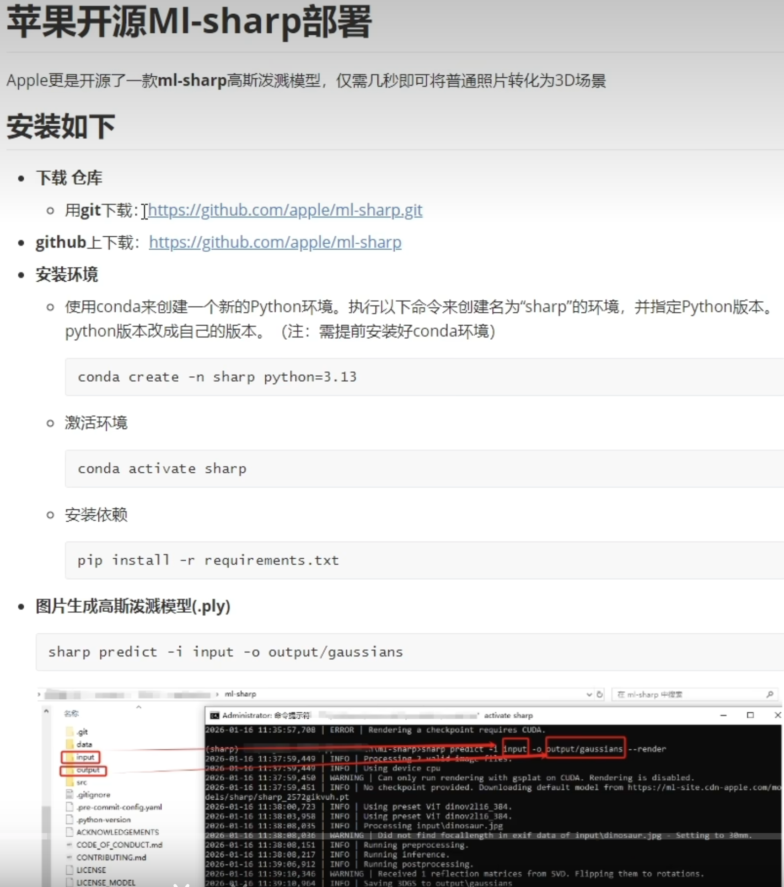
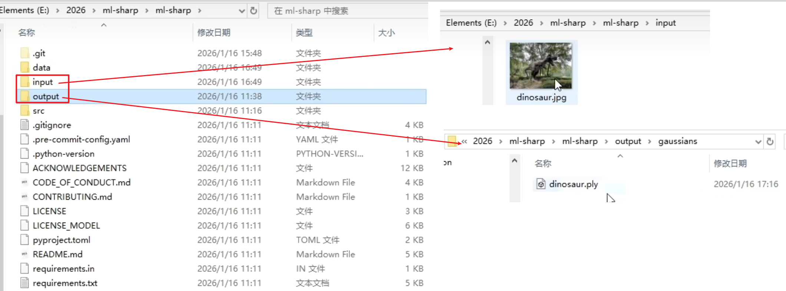
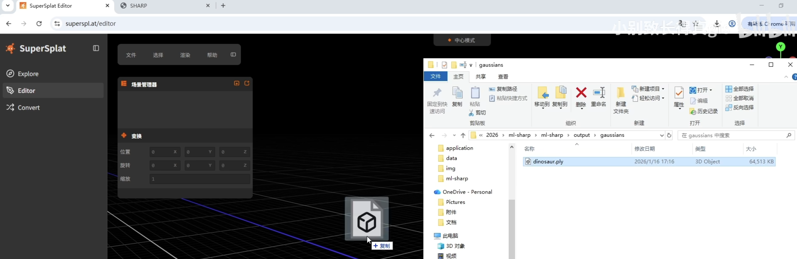
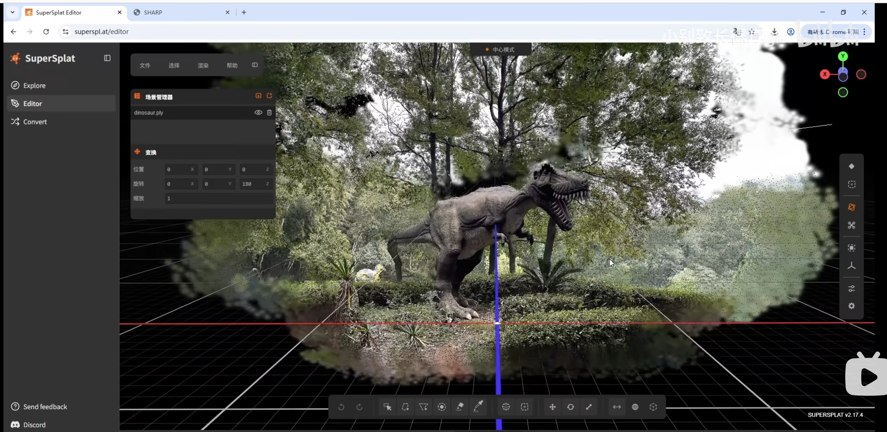

# 1. ml-sharp 部署



```sh
## 1.1 创建conda环境并激活
conda create -n ml-sharp python=3.13
conda activate ml-sharp

## 1.2 安装 ml-sharp
git clone https://github.com/apple/ml-sharp.git

cd ml-sharp

pip install -r requirements.txt

## 1.3 预测
sharp predict -i 0input  -o 1output/gaussians   --device cpu
```







