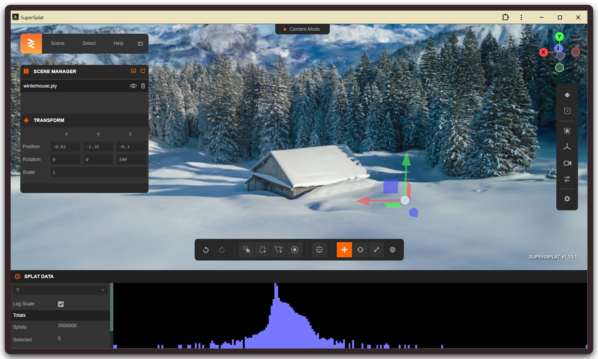

# 3DGS工具

```txt
https://superspl.at/editor 需要联网，又没有类似的本地运行的高斯泼溅工具?
```

SuperSplat支持通过GitHub源码或PWA方式在本地环境独立运行，满足离线编辑需求。此外，Postshot、Lichtfeld Studio以及Blender结合插件等工具可提供专业的本地化高斯泼溅编辑与训练功能。
SuperSplat更多本地部署细节及工具推荐请参考 https://github.com/playcanvas/supersplat

