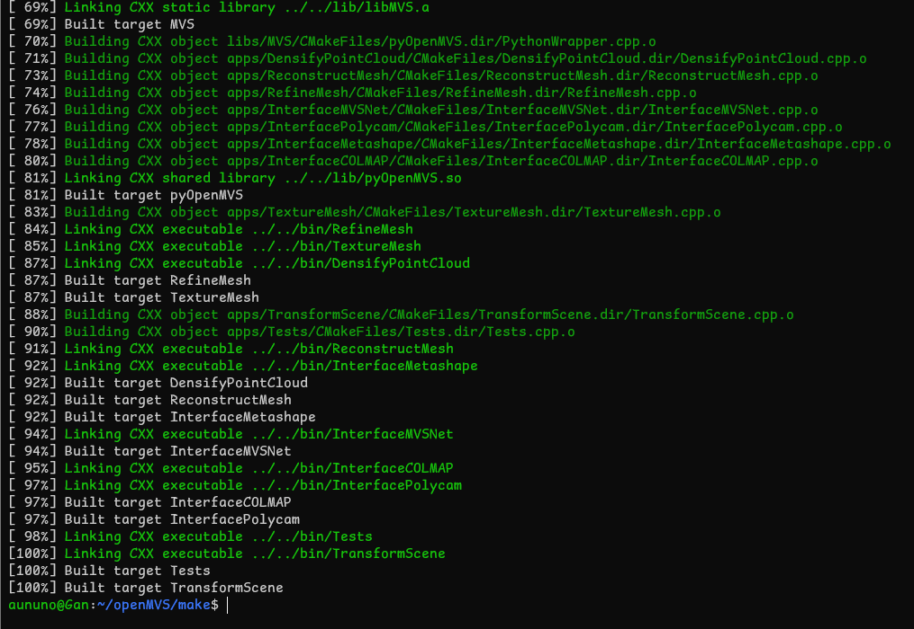

# 1.OpenMVS 安装使用教程
 
2025-09-18 
使用 OpenMVS 进行稠密重建、曲面重建和网格优化等。

## 1.手动编译安装
源码地址：https://github.com/cdcseacave/openMVS

本文的编译环境和实验平台：WSL version: 2.6.1.0, Ubuntu 22.04

第一步，使用以下命令安装一个新环境：
```sh
$ wsl --install -d Ubuntu-22.04
Launching Ubuntu 22.04 LTS...
Installing, this may take a few minutes...
Please create a default UNIX user account. The username does not need to match your Windows username.
For more information visit: https://aka.ms/wslusers
#输入用户名密码什么的
Enter new UNIX username:
New password:
Retype new password:
passwd: password updated successfully
Installation successful!
```
（可以参照本文移动安装位置，不再赘述）


第二步，安装工具与依赖项：
```sh
# -----------------Tools-----------------
sudo apt update && sudo apt upgrade -y
sudo apt install git cmake g++  build-essential python3-dev libpng-dev libjpeg-dev libtiff-dev libglu1-mesa-dev
# -----------------Dependencies-----------------
# Eigen
git clone https://gitlab.com/libeigen/eigen.git --branch 3.4
cd eigen && mkdir build && cd build
cmake ..
make -j10 && sudo make install && cd ../..

# Boost
sudo apt-get -y install libboost-iostreams-dev libboost-program-options-dev libboost-system-dev libboost-serialization-dev

# OpenCV
sudo apt-get -y install libopencv-dev

# CGAL
sudo apt-get -y install libcgal-dev libcgal-qt5-dev

#  OpenMVS v2.4.0 引入了对 JPEG XL (libjxl) 图像格式的支持
sudo apt-get install libjxl-dev

# VCGLib
git clone https://github.com/cdcseacave/VCG.git vcglib

# nanoflann
git clone https://github.com/jlblancoc/nanoflann.git
cd nanoflann
cmake -S . -B build
sudo cmake --install build

# glfw3
sudo apt install -y libglfw3-dev libglfw3

 
# 
# -----------------OpenMVS-----------------
git clone --recurse-submodules https://github.com/cdcseacave/openMVS.git
mv vcglib ./openMVS/3rd
cd openMVS
git checkout  v2.4.0 ## v2.3.0  
git submodule update --init --recursive
mkdir make02 && cd make02
export VCG_ROOT=/home/abner/Documents/jobs/task/blender/task03v2mesh/3rd/openMVS/3rd/vcglib
cmake ..  --debug-find -DCMAKE_C_COMPILER=/usr/bin/gcc -DCMAKE_CXX_COMPILER=/usr/bin/g++  -DCMAKE_C_CREATE_STATIC_LIBRARY="<CMAKE_AR> qc <TARGET> <LINK_FLAGS> <OBJECTS>" -DCMAKE_PREFIX_PATH=/usr/lib/x86_64-linux-gnu -DCMAKE_BUILD_TYPE=Release  -DVCG_ROOT="${VCG_ROOT}"  -DBUILD_SHARED_LIBS=OFF  -DCMAKE_CXX_FLAGS="-I/usr/include/python3.12 -I/usr/include/x86_64-linux-gnu/python3.12  -I${VCG_ROOT}  -w"  -DCMAKE_CXX_STANDARD=17 -DCMAKE_C_STANDARD=99
cmake --build . -j12
```
 
（如上图所示，编译成功。）

## 2.使用说明
以稠密重建为例：

先 cd ~，浅克隆一个文件夹： git clone --depth=1 https://github.com/cdcseacave/openMVS_sample.git。

然后 cd ~/openMVS/make，运行：

```sh
$ ./bin/DensifyPointCloud -w ~/openMVS_sample -i scene.mvs -o test_dense.mvs

./3rd/openMVS/make/bin/DensifyPointCloud -w ./3rd/openMVS_sample -i ./3rd/openMVS_sample/scene.mvs -o ./3rd/openMVS_sample/test_dense.mvs
```

就能在 openMVS_sample 文件夹下看到输出文件了。

然后按照这篇博客安装 Meshlab ，然后导入.ply文件即可。
```sh
abner@abner:~$ sudo apt install meshlab
```


===============================================================

# 2.Ubuntu 安装并使用OpenMVG和OpenMVS(保姆级教程)
原创
已于 2024-04-05 18:43:20 修改
原文链接：https://blog.csdn.net/weixin_61265732/article/details/125896332 
 
本文详细介绍了如何在Linux环境下安装OpenMVG和OpenMVS，包括依赖库的安装、源码编译及配置。通过这两个工具，可以实现从照片到三维重建的流程，包括稀疏点云生成、点云密集化、纹理映射和最终的三维模型重建。同时，文章提到了可能出现的问题及其解决方案，并提供了命令行操作的脚本，便于自动化处理。

## 1.说明：

需要的工具：
• CMake
• Git
• C/C++ compiler(GCC, Visual Studio or Clang)

## 2.OpenMVG 安装


核心功用
```
> 1.运动恢复结构 (SfM)：这是它最主要的功能。它通过分析一系列从不同角度拍摄的静态照片，计算出：
     相机参数：每一张照片拍摄时的精确位置（姿态）和镜头焦距（内参）。
     稀疏点云：在三维空间中生成初步的点云模型。
> 2.特征提取与匹配：自动识别不同图片中的相同物体特征点，并将它们关联起来。
> 3.为 3DGS 提供“种子”：高斯泼溅在开始训练之前，需要一个初始的点云位置和相机视角。OpenMVG 生成的 相机位姿 和 稀疏点云 就是高斯点初始化的依据。 
```

与 COLMAP 的关系 
```
在 3DGS 社区中，COLMAP 是更常用的工具，但 OpenMVG 具有以下特点：
> 模块化：它的代码结构更简单，方便开发者集成到自己的系统中。
> 计算效率：在某些特定场景下，其全局 SfM 算法可能比 COLMAP 的增量式算法更快。
> 生态组合：通常与 OpenMVS 配合使用，完成从“稀疏重建”到“稠密重建及贴图”的全过程。 
```


1) 安装依赖
```sh 
sudo apt-get install libxxf86vm1 libxxf86vm-dev libpng-dev libjpeg-dev libtiff-dev libxi-dev libxrandr-dev
```

2) Graphviz for view graph svg logs.
```sh
sudo apt-get install graphviz
```

3) 下载 OpenMVG
 
```sh 
git clone https://github.com/openMVG/openMVG.git
cd openMVG
mkdir openMVG_Build && cd openMVG_Build
```
4) 编译并安装
 ```sh
cmake -DCMAKE_BUILD_TYPE=RELEASE ../openMVG/src/
cmake --build . --target install
```
 
## 3 安装 OpenMVS
依赖:
• Eigen version 3.4 or higher
• OpenCV version 2.4 or higher
• Ceres version 1.10 or higher
• CGAL version 4.2 or higher
• Boost version 1.56 or higher
• VCG
• GLFW
说明：OpenCV 和 Eigen 的安装方式网上有很多，此处就不浪费篇幅了。我使用的是OpenCV3.4和Eigen3.4

### 3.1 安装依赖
1) 安装所需依赖:
```sh
sudo apt-get install libglu1-mesa-dev
```

2) CGAL (Required)
```sh
sudo apt-get install libcgal-dev libcgal-qt5-dev
```

3) Boost (Required)
```sh
sudo apt-get install libboost-iostreams-dev libboost-program-options-dev libboost-system-dev libboost-serialization-dev
```

4) VCGLib (Required)
将 vcglib 里面的 vcg、warp 等文件夹移动到系统的 include 文件夹里即可。

通过cp -r 命令
```sh
git clone https://github.com/cdcseacave/VCG.git vcglib
```

5) Ceres (Optional)
```sh
$ sudo apt-get install libatlas-base-dev libsuitesparse-dev
$ git clone https://ceres-solver.googlesource.com/ceres-solver ceres-solver
$ cd ceres-solver && mkdir ce_build && cd ce_build $ cmake ..
$ sudo make -j2 && sudo make install
```

6) GLFW3 (Optional)
 
```sh
sudo apt-get install freeglut3-dev libglew-dev libglfw3-dev
```
3.2 编译并安装 OpenMVS
在项目文件夹运行下面的命令
```sh
mkdir openMVS_build && cd openMVS_build
```

在 cmake 的时候一定要将 build_ type 设置为 release

可以通过cmake-gui来设置
```sh
cmake ..
```

编译并安装:

```sh
make -j4 && sudo make install
```

build 文件夹下的 bin 里面就是编译生成的可执行文件就是我们所需要的。

## 4 OpenMVG+OpenMVS 三维重建
 可以通过如图的方式创建文件夹，bin 文件夹就是 OpenMVS 编译生成的，将照片放入 images 文件夹中
 

  下面就我们就可以对数据集进行三维重建。我们可以将这些命令写入一个sh 脚本，这样方便点
```sh        
#!/bin/bash

# 使用OpenMVG生成稀疏点云图
#第一个命令-f 后面跟的是拍摄照片时的焦距与照片长边像素个数的乘积
openMVG_main_SfMInit_ImageListing -i images -o matches -f 3399
openMVG_main_ComputeFeatures -i matches/sfm_data.json -o matches/
openMVG_main_ComputeMatches -i matches/sfm_data.json -o matches/matches.txt
openMVG_main_SfM -i matches/sfm_data.json -o matches/ --match_file matches/matches.txt
openMVG_main_ExportUndistortedImages -i matches/sfm_data.json -o matches/image
openMVG_main_openMVG2openMVS -i matches/sfm_data.bin -o scene.mvs
 
#使用OpenMVS
./../bin/DensifyPointCloud scene.mvs
./../bin/ReconstructMesh scene_dense.mvs
./../bin/RefineMesh scene_dense_mesh.mvs
./../bin/TextureMesh scene_dense_mesh_refine.mvs
./../bin/Viewer scene_dense_mesh_refine_texture.mvs
```

效果如图：

## 5 额外的说明

### 5.1 出现的一个小问题
   如果 Ceres 不是通过 git 命令下载的可能会出现子模块没下载的问题


解决方法: 通过图中给出命令，完成子模块的下载。
```sh
git submodule update
```

### 5.2 OpenMVG 命令使用方式
        在 OpenMVG 包里面找到 tutorial_ demo.py.in，这个文本中包含了对命令的说明。

 
==============================================
# 3.ubuntu20.04安装openMVG和openMVS
https://www.cnblogs.com/zhongllmm/p/16449640.html

## 1、安装openMVG

主要按照官方教程安装基本上不会出错：

https://github.com/openMVG/openMVG/blob/develop/BUILD.md#using-openmvg-as-a-third-party-library-dependency-with-cmake

有问题可以查找：

https://github.com/openMVG/openMVG/issues

主要过程：
```sh
$ sudo apt-get install libpng-dev libjpeg-dev libtiff-dev libxxf86vm1 libxxf86vm-dev libxi-dev libxrandr-dev

$ sudo apt-get install graphviz
$ cd library

$ git clone --recursive https://github.com/openMVG/openMVG.git
$ cd openMVG
$ mkdir openMVG_Build && cd openMVG_Build

$ cmake -DCMAKE_BUILD_TYPE=RELEASE ../src/  -DOpenMVG_BUILD_TESTS=ON
$ cmake --build . --target install

$ make test
$ ctest --output-on-failure -j
```

## 2、安装openMVS

安装步骤主要按照官方文档：https://github.com/cdcseacave/openMVS/wiki/Building

有问题可以查找：https://github.com/cdcseacave/openMVS/issues
```sh
#Prepare and empty machine for building:
sudo apt-get update -qq && sudo apt-get install -qq
sudo apt-get -y install git cmake libpng-dev libjpeg-dev libtiff-dev libglu1-mesa-dev
main_path=`pwd`

#Eigen (Required)
git clone https://gitlab.com/libeigen/eigen.git --branch 3.4
mkdir eigen_build && cd eigen_build
cmake . ../eigen
make && sudo make install
cd ..

#Boost (Required)
sudo apt-get -y install libboost-iostreams-dev libboost-program-options-dev libboost-system-dev libboost-serialization-dev

#OpenCV (Required)
sudo apt-get -y install libopencv-dev

#CGAL (Required)
sudo apt-get -y install libcgal-dev libcgal-qt5-dev

#VCGLib (Required)
git clone https://github.com/cdcseacave/VCG.git vcglib

#Ceres (Optional)
sudo apt-get -y install libatlas-base-dev libsuitesparse-dev
git clone https://ceres-solver.googlesource.com/ceres-solver ceres-solver
mkdir ceres_build && cd ceres_build
cmake . ../ceres-solver/ -DMINIGLOG=ON -DBUILD_TESTING=OFF -DBUILD_EXAMPLES=OFF
make -j2 && sudo make install
cd ..

#GLFW3 (Optional)
sudo apt-get -y install freeglut3-dev libglew-dev libglfw3-dev

#OpenMVS
git clone https://github.com/cdcseacave/openMVS.git openMVSmkdir openMVS_build && cd openMVS_build
cmake . ../openMVS -DCMAKE_BUILD_TYPE=Release -DVCG_ROOT="$main_path/vcglib"

#If you want to use OpenMVS as shared library, add to the CMake command:
-DBUILD_SHARED_LIBS=ON(这一句最好不要加，不然之后安装可能一直安装不上）

#Install OpenMVS library (optional):
make -j2 && sudo make install
```

如果按照官方文档安装出现错误，可以查看你安装的库的版本是否符合要求

```sh
Eigen version 3.4 or higher
    OpenCV version 2.4 or higher
    Ceres version 1.10 or higher
    CGAL version 4.2 or higher
    Boost version 1.56 or higher
    VCG
    GLFW
```

关于遇到的问题：

1.
```sh
/home/zll/library/openMVS/libs/MVS/PatchMatchCUDA.cu(267): error: calling a __host__ function("Eigen::MatrixBase< ::Eigen::Matrix<float, (int)3, (int)3, (int)0, (int)3, (int)3> > ::inverse() const") from a __device__ function("ComputeHomography") is not allowed/home/zll/library/openMVS/libs/MVS/PatchMatchCUDA.cu(267): error: identifier "Eigen::MatrixBase< ::Eigen::Matrix<float, (int)3, (int)3, (int)0, (int)3, (int)3> > ::inverse const" is undefined in device code2 errors detected in the compilation of "/home/zll/library/openMVS/libs/MVS/PatchMatchCUDA.cu".make[2]: *** [libs/MVS/CMakeFiles/MVS.dir/build.make:317：libs/MVS/CMakeFiles/MVS.dir/PatchMatchCUDA.cu.o] 错误 1make[2]: *** 正在等待未完成的任务....
```

解决方法：

Eigen3.3.9不行，换Eigen3.4

https://gitlab.com/libeigen/eigen/-/archive/3.4.0/eigen-3.4.0.zip

2、

```
/usr/bin/ld: CMakeFiles/InterfaceCOLMAP.dir/InterfaceCOLMAP.cpp.o: undefined reference to symbol '_ZTVN7SEACAVE6CImageE'
/usr/bin/ld: /home/zll/library/openMVS/openMVS_build/lib/libIO.so: error adding symbols: DSO missing from command line
collect2: error: ld returned 1 exit status
/usr/bin/ld: CMakeFiles/InterfaceMetashape.dir/InterfaceMetashape.cpp.o: undefined reference to symbol '_ZNK8tinyxml27XMLNode17FirstChildElementEPKc'
/usr/bin/ld: /home/zll/library/openMVS/openMVS_build/lib/libIO.so: error adding symbols: DSO missing from command line
collect2: error: ld returned 1 exit status
```
解决方法：

cmake时去掉 -DBUILD_SHARED_LIBS=ON


=============================================================

#  4.vcpkg 如何安装 OpenMVS
VCPKG 是微软推出的 C/C++ 包管理工具，支持 Windows、Linux、macOS 等平台，以下是**通用安装步骤**，并结合你提供的 OpenMVS 项目上下文补充适配说明：

### 一、基础安装步骤（全平台通用）
#### 1. 克隆 VCPKG 仓库
首先将 VCPKG 仓库克隆到本地（建议放在无中文/空格的路径下）：
```bash
# 克隆仓库（默认拉取最新版本）
git clone https://github.com/microsoft/vcpkg.git

# 进入 vcpkg 目录
cd vcpkg
```

#### 2. 启动安装脚本
- **Windows（PowerShell）**：
  ```powershell
  .\bootstrap-vcpkg.bat
  ```
- **Linux/macOS（Bash）**：
  ```bash
  ./bootstrap-vcpkg.sh
  ```
  脚本会自动编译 vcpkg 可执行文件，完成后目录下会出现 `vcpkg`（Linux/macOS）或 `vcpkg.exe`（Windows）。

#### 3. （可选）添加到系统环境变量
为了全局调用 `vcpkg`，可将其路径加入系统环境变量：
- **Windows**：将 `vcpkg` 所在目录（如 `D:\vcpkg`）添加到 `PATH` 环境变量；
- **Linux/macOS**：执行 `echo 'export PATH="$PATH:/path/to/vcpkg"' >> ~/.bashrc`（或 `~/.zshrc`），然后 `source ~/.bashrc`。

### 二、结合 OpenMVS 项目的 VCPKG 使用说明
从你提供的代码片段（如 `continuous_integration.yml`）可以看到，OpenMVS 已集成 VCPKG 构建流程，补充以下适配点：

#### 1. 指定 VCPKG 版本（可选）
OpenMVS 的 CI 流程中固定了 VCPKG 提交 ID（`VCPKG_COMMIT: 'ef7dbf94b9198bc58f45951adcf1f041fcbc5ea0'`），若需对齐版本：
```bash
cd vcpkg
git checkout ef7dbf94b9198bc58f45951adcf1f041fcbc5ea0
```

#### 2. OpenMVS 依赖的 VCPKG 安装（示例）
OpenMVS 依赖 Eigen、Boost、OpenCV、CGAL 等，可通过 VCPKG 一键安装：
```bash
# 安装单个依赖（以 Windows x64 为例）
vcpkg install eigen3:x64-windows
vcpkg install boost:x64-windows
vcpkg install opencv:x64-windows
vcpkg install cgal:x64-windows

# Linux/macOS 示例（x64-linux/arm64-osx）
vcpkg install eigen3:x64-linux
vcpkg install boost:x64-linux
```

#### 3. 构建 OpenMVS 时关联 VCPKG
OpenMVS 的 CMake 配置已通过 `-DVCPKG_TARGET_TRIPLET` 指定 VCPKG 目标三元组（如 `x64-windows-release`），手动构建时可显式指定 VCPKG 工具链：
```bash
# 进入 OpenMVS 构建目录
mkdir build && cd build

# Windows
cmake .. -DCMAKE_TOOLCHAIN_FILE=/path/to/vcpkg/scripts/buildsystems/vcpkg.cmake -DVCPKG_TARGET_TRIPLET=x64-windows-release -DOpenMVS_USE_CUDA=OFF

# Linux/macOS（使用 Ninja 构建）
cmake .. -DCMAKE_TOOLCHAIN_FILE=/path/to/vcpkg/scripts/buildsystems/vcpkg.cmake -DVCPKG_TARGET_TRIPLET=x64-linux-release -DOpenMVS_USE_CUDA=OFF -G Ninja
```

### 三、关键注意事项
1. **三元组（Triplet）**：VCPKG 用三元组区分平台/架构/编译模式，OpenMVS 用到的三元组包括：
   - Windows：`x64-windows-release`
   - Linux：`x64-linux-release`
   - macOS：`arm64-osx`（M 系列芯片）/ `x64-osx`（Intel）
2. **二进制缓存**：OpenMVS 的 CI 启用了 VCPKG 二进制缓存（`VCPKG_BINARY_SOURCES: clear;x-gha,readwrite`），本地可通过 `vcpkg cache` 管理缓存；
3. **权限问题**：Linux/macOS 下安装系统级依赖时需 sudo，如 `sudo apt-get install libgl-dev`（OpenMVS 依赖的系统库）。

### 四、常用 VCPKG 命令
```bash
# 搜索包
vcpkg search eigen3

# 安装包
vcpkg install <包名>:<三元组>

# 卸载包
vcpkg remove <包名>:<三元组>

# 列出已安装包
vcpkg list

# 更新 vcpkg 本身
vcpkg update
```

如果是在 OpenMVS 的 Dev Container/Docker 环境中，VCPKG 会被自动集成（参考 `.devcontainer` 目录下的配置），无需手动安装，仅需确保容器构建完成即可。