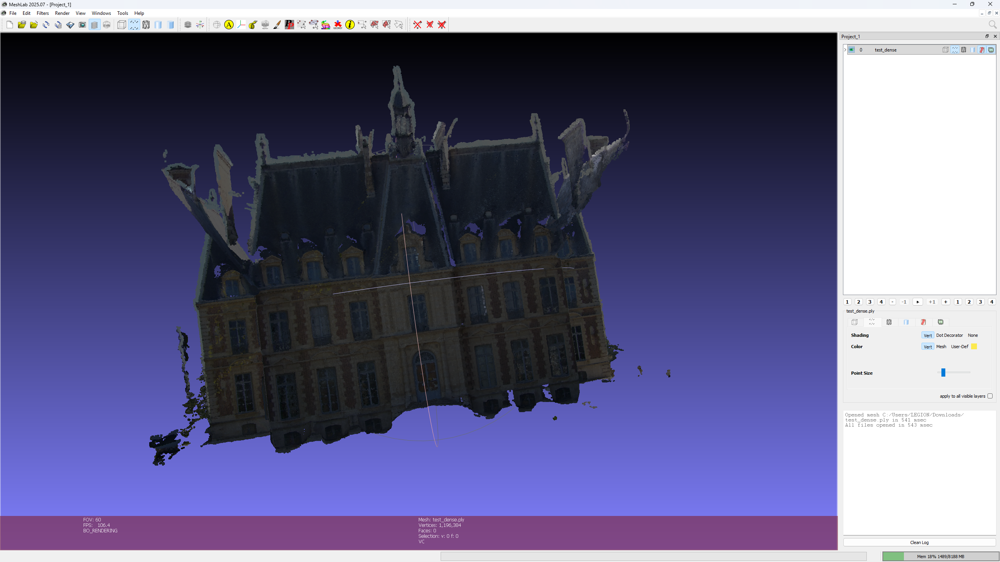

# 1.OpenMVS 安装使用教程
 
2025-09-18 
使用 OpenMVS 进行稠密重建、曲面重建和网格优化等。

## 1.手动编译安装
源码地址：https://github.com/cdcseacave/openMVS

本文的编译环境和实验平台：WSL version: 2.6.1.0, Ubuntu 22.04

第一步，使用以下命令安装一个新环境：
```sh
$ wsl --install -d Ubuntu-22.04
Launching Ubuntu 22.04 LTS...
Installing, this may take a few minutes...
Please create a default UNIX user account. The username does not need to match your Windows username.
For more information visit: https://aka.ms/wslusers
#输入用户名密码什么的
Enter new UNIX username:
New password:
Retype new password:
passwd: password updated successfully
Installation successful!
```
（可以参照本文移动安装位置，不再赘述）


第二步，安装工具与依赖项：
```sh
# -----------------Tools-----------------
sudo apt update && sudo apt upgrade -y
sudo apt install git cmake g++  build-essential python3-dev libpng-dev libjpeg-dev libtiff-dev libglu1-mesa-dev
# -----------------Dependencies-----------------
# Eigen
git clone https://gitlab.com/libeigen/eigen.git --branch 3.4
cd eigen && mkdir build && cd build
cmake ..
make -j10 && sudo make install && cd ../..

# Boost
sudo apt-get -y install libboost-iostreams-dev libboost-program-options-dev libboost-system-dev libboost-serialization-dev

# OpenCV
sudo apt-get -y install libopencv-dev

# CGAL
sudo apt-get -y install libcgal-dev libcgal-qt5-dev

#  OpenMVS v2.4.0 引入了对 JPEG XL (libjxl) 图像格式的支持
sudo apt-get install libjxl-dev

# VCGLib
cd 3rd/openMVS/3rd
git clone https://github.com/cdcseacave/VCG.git vcglib

# nanoflann
git clone https://github.com/jlblancoc/nanoflann.git
cd nanoflann
cmake -S . -B build
sudo cmake --install build

# glfw3
sudo apt install -y libglfw3-dev libglfw3

# glad
编译 glad，参考 doc/build-glad.md


# 
# -----------------OpenMVS-----------------
git clone --recurse-submodules https://github.com/cdcseacave/openMVS.git
cd openMVS
git checkout  v2.4.0  
git submodule update --init --recursive
mkdir make02 && cd make02
export VCG_ROOT=/home/abner/Documents/jobs/task/blender/task03v2mesh/3rd/openMVS/3rd/vcglib
cmake ..  --debug-find -DCMAKE_C_COMPILER=/usr/bin/gcc -DCMAKE_CXX_COMPILER=/usr/bin/g++  -DCMAKE_C_CREATE_STATIC_LIBRARY="<CMAKE_AR> qc <TARGET> <LINK_FLAGS> <OBJECTS>" -DCMAKE_PREFIX_PATH=/usr/lib/x86_64-linux-gnu -DCMAKE_BUILD_TYPE=Release  -DVCG_ROOT="${VCG_ROOT}"  -DBUILD_SHARED_LIBS=OFF  -DCMAKE_CXX_FLAGS="-I/usr/include/python3.12 -I/usr/include/x86_64-linux-gnu/python3.12  -I${VCG_ROOT}  -w"  -DCMAKE_CXX_STANDARD=17 -DCMAKE_C_STANDARD=99
cmake --build . -j12
```
 
（如上图所示，编译成功。）

## 2.使用说明
以稠密重建为例：

先 cd ~，浅克隆一个文件夹： git clone --depth=1 https://github.com/cdcseacave/openMVS_sample.git。

然后 cd ~/openMVS/make，运行：

```sh
$ ./bin/DensifyPointCloud -w ~/openMVS_sample -i scene.mvs -o test_dense.mvs

./3rd/openMVS/make/bin/DensifyPointCloud -w ./3rd/openMVS_sample -i ./3rd/openMVS_sample/scene.mvs -o ./3rd/openMVS_sample/test_dense.mvs
```

就能在 openMVS_sample 文件夹下看到输出文件了。

然后按照这篇博客安装 Meshlab ，然后导入.ply文件即可。
```sh
abner@abner:~$ sudo apt install meshlab
```




